# Udacity Project Knowledge Graph and Requirement Audit

## Knowledge Graph

```mermaid
graph TD
    A[Project Goal: Reproducible Weekly NYC Airbnb Pricing Pipeline]
    A --> B[Preliminary Setup]
    A --> C[Pipeline Orchestration]
    A --> D[EDA]
    A --> E[Basic Cleaning]
    A --> F[Data Checks]
    A --> G[Split Data]
    A --> H[Train Random Forest]
    A --> I[Hyperparameter Search]
    A --> J[Model Selection and Prod Tag]
    A --> K[Test Regression Model]
    A --> L[Release and Retrain on sample2]
    A --> M[Submission Evidence]

    B --> B1[Conda env from environment.yml]
    B --> B2[W&B API login]
    B --> B3[Repo fork and push]

    C --> C1[main.py step routing via Hydra + MLflow]

    D --> D1[src/eda/EDA.ipynb loads sample.csv:latest]
    D --> D2[Notebook markdown and cleaning checks]

    E --> E1[src/basic_cleaning/run.py filters price]
    E --> E2[src/basic_cleaning/run.py parses last_review]
    E --> E3[src/basic_cleaning/run.py applies NYC bounds]
    E --> E4[clean_sample.csv artifact logged to W&B]

    F --> F1[src/data_check/test_data.py row count test]
    F --> F2[src/data_check/test_data.py price range test]
    F --> F3[KL drift test vs reference alias]

    G --> G1[train_val_test_split component invoked]
    G --> G2[trainval_data.csv and test_data.csv artifacts]

    H --> H1[src/train_random_forest/run.py preprocess + fit]
    H --> H2[MLflow sklearn export]
    H --> H3[W&B model_export artifact + MAE/R2]

    I --> I1[Hydra multirun over tfidf and max_features]

    J --> J1[Manual W&B sorting by MAE]
    J --> J2[Tag best model as prod]

    K --> K1[test_regression_model uses random_forest_export:prod]

    L --> L1[GitHub release 1.0.0]
    L --> L2[Run release on sample2 expected fail first]
    L --> L3[NYC boundary fix release 1.0.1+]

    M --> M1[README includes public W&B + GitHub links]
    M --> M2[Submission Details includes both links]
```

## Requirement Status (Audit)

- PASS: Main pipeline wiring for required stages exists in [main.py](main.py).
- PASS: basic_cleaning component structure exists in [src/basic_cleaning/MLproject](src/basic_cleaning/MLproject), [src/basic_cleaning/conda.yml](src/basic_cleaning/conda.yml), [src/basic_cleaning/run.py](src/basic_cleaning/run.py).
- PASS: Cleaning logic includes price filter, datetime conversion, and NYC boundary filter in [src/basic_cleaning/run.py](src/basic_cleaning/run.py).
- PASS: data_check tests include row count and price range in [src/data_check/test_data.py](src/data_check/test_data.py).
- PASS: Random forest TODOs completed (artifact load, preprocessing pipeline, fit, export, log metrics/artifacts) in [src/train_random_forest/run.py](src/train_random_forest/run.py).
- PASS: EDA notebook exists and includes markdown + W&B artifact fetch in [src/eda/EDA.ipynb](src/eda/EDA.ipynb).
- PASS: README has submission-links section in [README.md](README.md).
- PARTIAL: README links are placeholders and must be replaced in [README.md](README.md).
- PENDING (manual): Public W&B project visibility and artifact/tag actions (reference, prod).
- PENDING (manual): Full pipeline execution evidence and artifact generation in W&B.
- PENDING (manual): Hyperparameter sweep run and best-model selection proof.
- PENDING (manual): GitHub release 1.0.0 and follow-up release if needed.
- PENDING (manual): Submission Details box includes both required links.

## To-Do Closure Map

- Closed in code:
  - basic_cleaning implementation
  - main.py step integration
  - data_check added tests
  - train_random_forest implementation
  - EDA notebook creation
  - README submission-links section

- Still open and must be executed externally:
  - Replace README link placeholders with real URLs
  - Ensure W&B project is public
  - Run pipeline in configured conda environment
  - Add W&B aliases/tags (reference, prod)
  - Run test_regression_model step
  - Create and publish GitHub release(s)
  - Submit with both links in Submission Details
